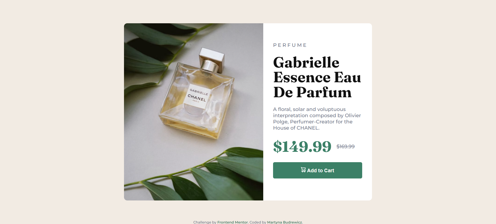
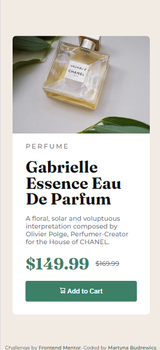

# Frontend Mentor - Product preview card component solution

This is a solution to the [Product preview card component challenge on Frontend Mentor](https://www.frontendmentor.io/challenges/product-preview-card-component-GO7UmttRfa).

## Table of contents

- [Overview](#overview)
  - [The challenge](#the-challenge)
  - [Screenshot](#screenshot)
  - [Links](#links)
- [My process](#my-process)
  - [Built with](#built-with)
  - [What I learned](#what-i-learned)
  - [Continued development](#continued-development)
  - [Useful resources](#useful-resources)
- [Author](#author)

**Note: Delete this note and update the table of contents based on what sections you keep.**

## Overview

### The challenge

Users should be able to:

- View the optimal layout depending on their device's screen size
- See hover and focus states for interactive elements

### Screenshot

### Links

- Solution URL: [Add solution URL here](https://your-solution-url.com)
- Live Site URL: [Add live site URL here](https://your-live-site-url.com)

## My process

### Built with

- Semantic HTML5 markup
- CSS custom properties
- Flexbox
- Mobile-first workflow

**Note: These are just examples. Delete this note and replace the list above with your own choices**

### What I learned

In this project I learned more about responsive design and how to implement mobile-first.

### Continued development

The picture object in desktop mode could be changed to fit exactly half of the object, but it would have to be figured out how to do this
Also a more correct way of implementing responsive fonts could be added

### Useful resources

- [Example resource 1](https://web.dev/learn/design/responsive-images) - Responsive images
- [Example resource 2](https://web.dev/learn/design/typography) - Typography
- [Example resource 2](https://web.dev/learn/design/typography) - Responsive design

## Author

- GitHub - [Martyna Budrewicz](https://github.com/martbudr)
- Frontend Mentor - [@martbudr](https://www.frontendmentor.io/profile/martbudr)