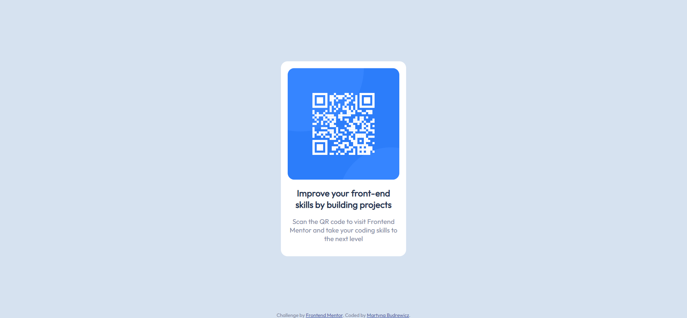

# Frontend Mentor - QR code component solution

This is a solution to the [QR code component challenge on Frontend Mentor](https://www.frontendmentor.io/challenges/qr-code-component-iux_sIO_H). Frontend Mentor challenges help you improve your coding skills by building realistic projects. 

## Table of contents

- [Overview](#overview)
  - [Screenshot](#screenshot)
  - [Links](#links)
- [My process](#my-process)
  - [Built with](#built-with)
  - [What I learned](#what-i-learned)
  - [Continued development](#continued-development)
- [Author](#author)

## Overview

This is a page showing a QR code to the Frontend Mentor site. It works both on desktops and mobile devices.

### Screenshot



### Links

- Solution URL: [Solution URL](https://github.com/martbudr/Frontend-Mentor---QR-code-component)
- Live Site URL: [Live Site URL](https://martbudr.github.io/Frontend-Mentor---QR-code-component/)

## My process

### Built with

- Semantic HTML5 markup
- CSS

### What I learned

There wasn't much html to write or learn, as it was mainly a CSS project.

I'm proud that I managed to position the white rectangle on the center of the screen and that the content inside it is positioned in the middle of the rectangle. I learned about padding, which helped me get the look of the content that I wanted to get. I also figured that I need to set the maximum width of the image, which made everything look as intended. Below is the code of the rectangle and the image:
```css
.rect{
    background-color: hsl(0, 0%, 100%);
    position: absolute;
    top: 50%;
    left: 50%;
    transform: translate(-50%, -50%);
    text-align: center;
    padding: 15px;
    width: 250px;
    height: auto;
}
img{
    max-width: 100%;
}
```

### Continued development

I need to learn more about the Content Division element (div) and its positioning on the page. As I was doing this challenge, I stumbled upon a question of how to place two divs alongside each other - which wasn't something I had to do in this challenge, but a thing that might be useful to be able to do in the future. Aside from that, I need to learn more about different types of positioning content on the page - relative, absolute and so on, and how to use it. Another important thing is scaling the page depending on the device's screen size.

## Author

- GitHub - [Martyna Budrewicz - martbudr](https://github.com/martbudr)
- Frontend Mentor - [@martbudr](https://www.frontendmentor.io/profile/martbudr)
