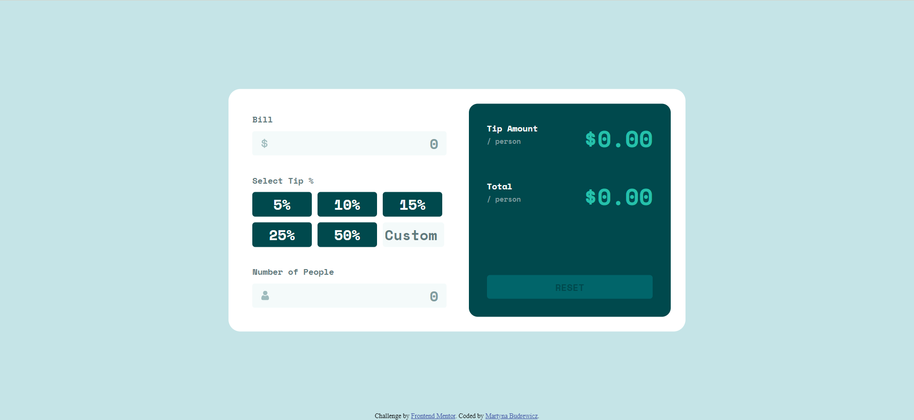
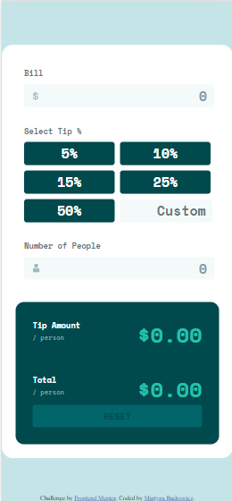

# Frontend Mentor - Tip calculator app solution

This is a solution to the [Tip calculator app challenge on Frontend Mentor](https://www.frontendmentor.io/challenges/tip-calculator-app-ugJNGbJUX). Frontend Mentor challenges help you improve your coding skills by building realistic projects.

## Table of contents

- [Overview](#overview)
  - [The challenge](#the-challenge)
  - [Screenshot](#screenshot)
  - [Links](#links)
- [My process](#my-process)
  - [Useful resources](#useful-resources)
- [Author](#author)

## Overview

### The challenge

Users should be able to:

- View the optimal layout for the app depending on their device's screen size
- See hover states for all interactive elements on the page
- Calculate the correct tip and total cost of the bill per person

### Screenshot

### Links

- Solution URL: [GitHub](https://github.com/martbudr/Frontend-Mentor---Tip-calculator-app)
- Live Site URL: [GitHub Sites](https://martbudr.github.io/Frontend-Mentor---Tip-calculator-app/)

## My process

### Useful resources

- [Matthew James Taylor](https://matthewjamestaylor.com/2-column-layouts#static-2-column-grid) - A great resource for different types of layout.
- [YouTube](https://www.youtube.com/watch?v=rWjntaq4FW4&ab_channel=zFunxWebDevelopementIdeas) - Great tutorial on placing .svg icon in input field.

## Author

- Frontend Mentor - [@martbudr](https://www.frontendmentor.io/profile/martbudr)
- GitHub - [@martbudr](https://www.github.com/martbudr)